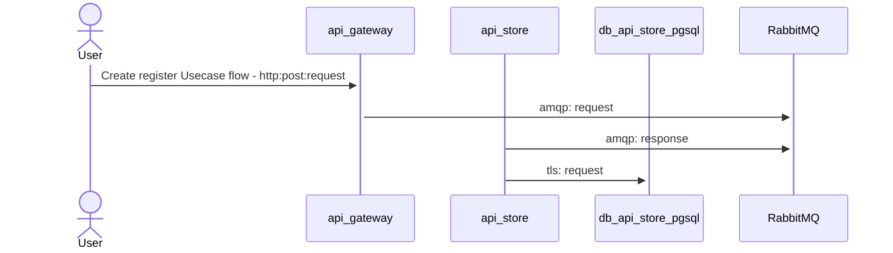
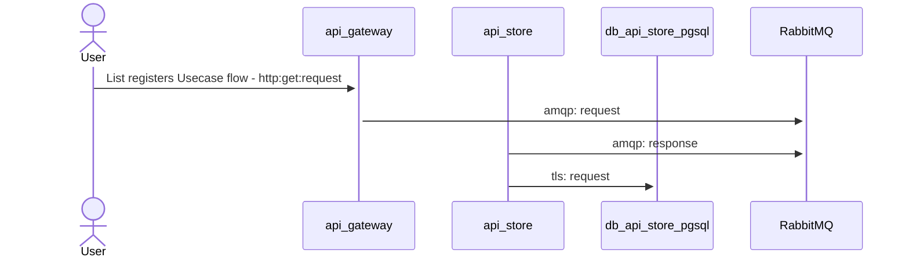

Microservices sequence diagram, using the mermaid tool.

```mermaid
sequenceDiagram
    actor User
    participant api_gateway
    participant api_store
    participant db_api_store_pgsql
    participant RabbitMQ

    User  ->>+ api_gateway: Create register Usecase flow - http:post:request
    api_gateway     ->>+ RabbitMQ:     amqp: request
    api_store     ->>+ RabbitMQ:      amqp: response
    api_store      ->>+ db_api_store_pgsql: tls: request
```

```mermaid
sequenceDiagram
    actor User
    participant api_gateway
    participant api_store
    participant db_api_store_pgsql
    participant RabbitMQ

    User  ->>+ api_gateway: List registers Usecase flow - http:get:request
    api_gateway     ->>+ RabbitMQ:     amqp: request
    api_store     ->>+ RabbitMQ:      amqp: response
    api_store      ->>+ db_api_store_pgsql: tls: request
```