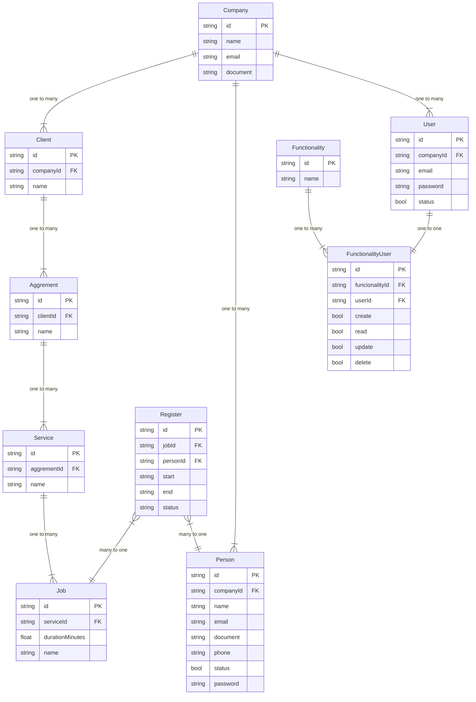

```mermaid
erDiagram
    Company {
        string id PK
        string name
        string email
        string document
    }
    Client {
        string id PK
        string companyId FK
        string name
    }
    Aggrement {
        string id PK
        string clientId FK
        string name
    }
    Service {
        string id PK
        string aggrementId FK
        string name
    }
    Job {
        string id PK
        string serviceId FK
        float durationMinutes
        string name
    }
    Person {
        string id PK
        string companyId FK
        string name
        string email
        string document
        string phone
        bool status
        string password
    }

    User {
        string id PK
        string companyId FK
        string email
        string password
        bool status
    }

    Functionality {
        string id PK
        string name
    }

    FunctionalityUser {
        string id PK
        string funcionalityId FK
        string userId FK
        bool create
        bool read
        bool update
        bool delete
    }

    Register {
        string id PK
        string jobId FK
        string personId FK
        string start
        string end
        string status
    }

    Company      ||--|{ Client : "one to many"
    Company      ||--|{ Person : "one to many"
    Company      ||--|{ User : "one to many"
    Client       ||--|{ Aggrement : "one to many"
    Aggrement    ||--|{ Service : "one to many"
    Service      ||--|{ Job : "one to many"
    Register     }|--|| Job : "many to one"
    Register     }|--|| Person : "many to one"
    User         ||--|| FunctionalityUser : "one to one"
    Functionality       ||--|{ FunctionalityUser : "one to many"

```